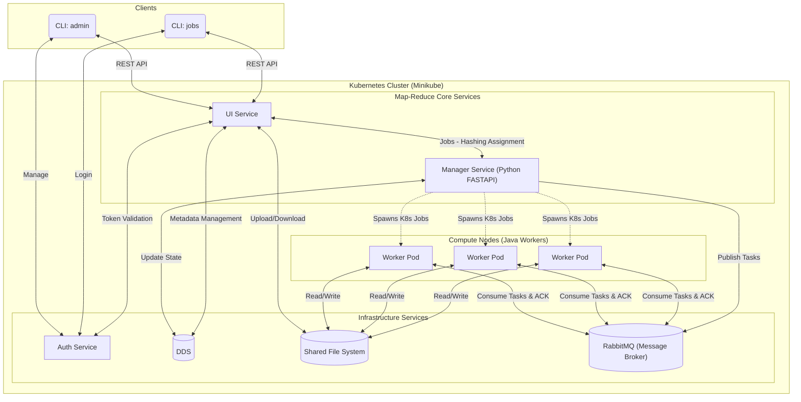
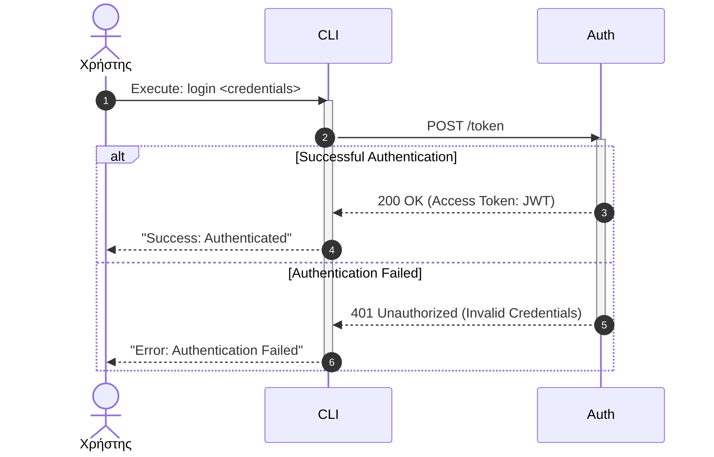
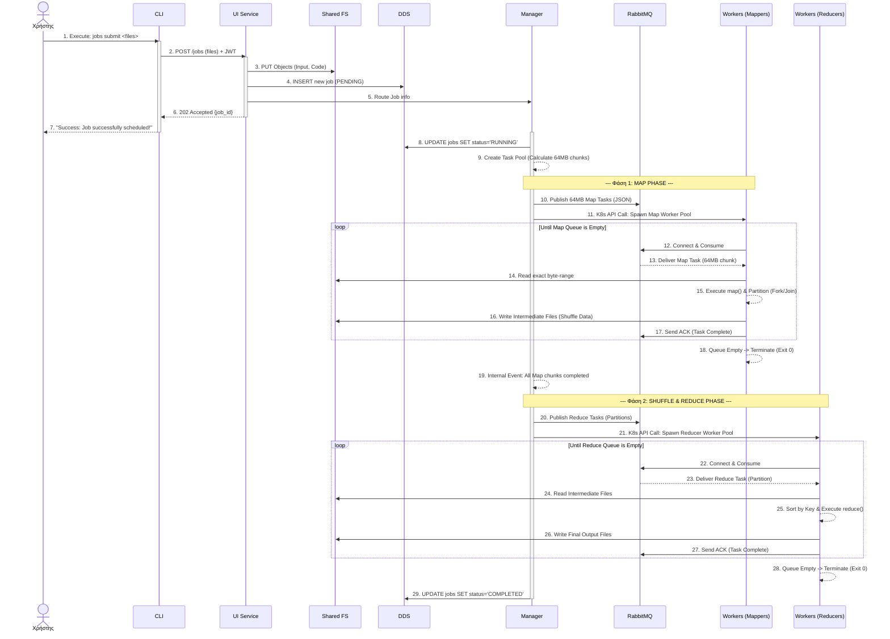
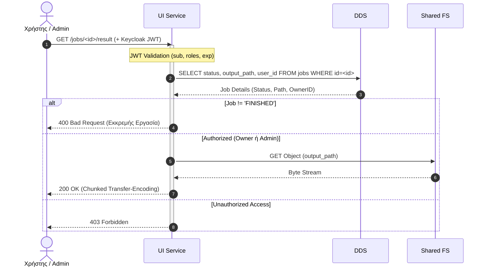
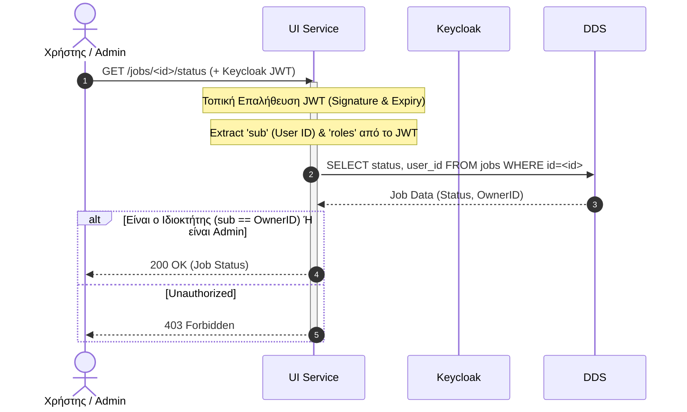
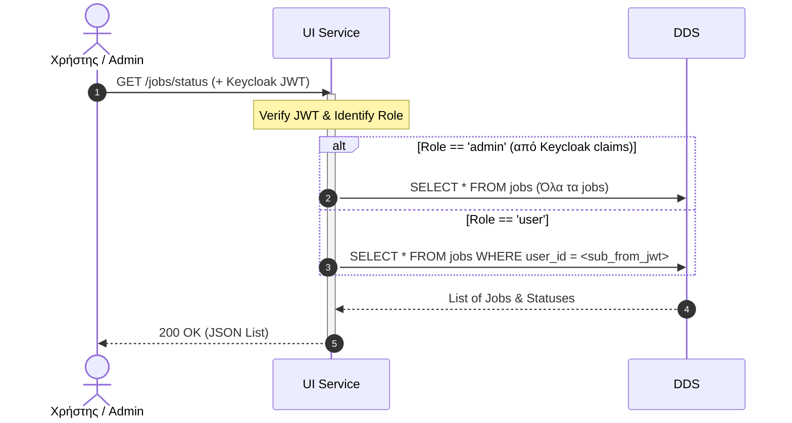
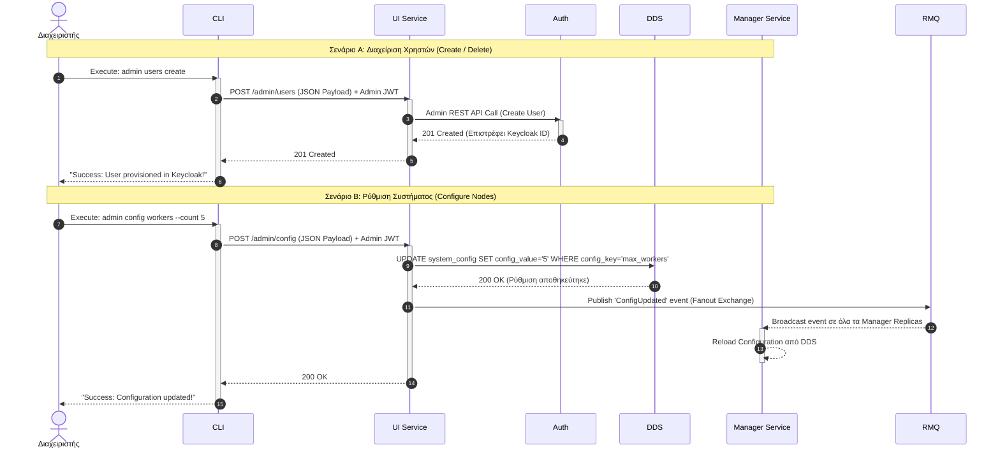
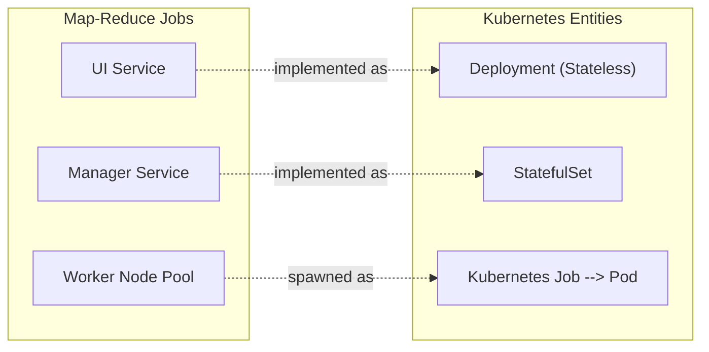
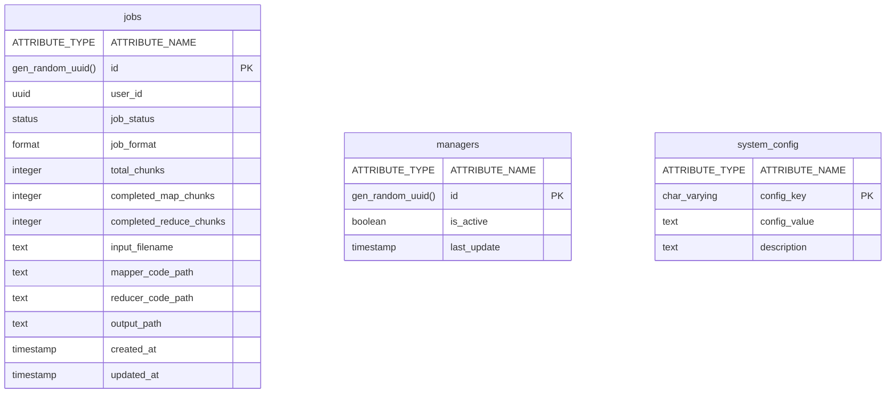

# Design Document: Map-Reduce on Kubernetes

**Μάθημα:** Principles of Distributed Systems  
**Θέμα Εργασίας:** Implementation of Map-Reduce on Kubernetes  
**Ομάδα 10:** ΚΑΡΑΒΑΓΓΕΛΗΣ ΓΕΩΡΓΙΟΣ, ΗΛΙΑΣ ΜΠΟΛΑΝΑΚΗΣ, ΙΑΣΩΝ ΚΟΥΡΜΟΥΛΗΣ

---

## 1. Technology Stack

Για την υλοποίηση του συστήματος επιλέχθηκαν τα παρακάτω εργαλεία και τεχνολογίες:

* **Γλώσσα Προγραμματισμού:** Python, Java.
* **Manager Service:** FASTAPI Framework.
* **Authentication Service:** Keycloak (πλήρης Identity Manager).
* **Distributed Data Service (DDS):** PostgreSQL (για την αποθήκευση της κατάστασης του συστήματος).
* **Message Broker (Task Queue):** RabbitMQ (για την ασύγχρονη επικοινωνία και διανομή των tasks μεταξύ Manager και Workers).
* **Shared File System:** MinIO (S3-compatible storage για την αποθήκευση αρχείων εισόδου/εξόδου/intermediate files).
* **Orchestration:** Kubernetes (Minikube).
* **Workers:** Java's Fork/Join Framework (for parallel computation).

Επιλέον, στο σύνολο του project αξιοποιούμε τα παρακάτω libraries:
* **kubernetes**
* **FastAPI + Uvicorn**
* **Boto3**
* **python-keycloak**
* **PyJWT**
* **asyncpg**
* **sqlalchemy**
* **python-multipart**

Coding Agents:
* **Gemini**
* **NotebookLM**

## 2. Αρχιτεκτονική Συστήματος & Microservices

Το σύστημα ακολουθεί αρχιτεκτονική microservices. Παρακάτω περιγράφεται ο ρόλος κάθε υπηρεσίας:

* **UI Service:** Το κεντρικό σημείο εισόδου (API Gateway) του συστήματος. Είναι μια stateless υπηρεσία (σχεδιασμένη ως Kubernetes Deployment για να αντέχει υψηλό φόρτο μέσω replication) που παρέχει το REST API στους clients . Αναλαμβάνει να δεχτεί τα αιτήματα, να αποθηκεύσει αρχικά τα αρχεία στο MinIO, να δημιουργήσει την εγγραφή στο DDS και να δρομολογήσει έξυπνα το Job στον κατάλληλο Manager μέσω Hashing.

* **Auth Service (Keycloak):** Το σύστημα που διαχειρίζεται κεντρικά την ταυτοποίηση των χρηστών (User Authentication) και την απόδοση ρόλων. Εφαρμόζει πολιτικές Single Sign-On (SSO). Κατά την επιτυχή σύνδεση, εκδίδει κρυπτογραφημένα JWT tokens, τα οποία στη συνέχεια συνοδεύουν κάθε αίτημα του χρήστη προς το UI Service για ασφαλή έλεγχο πρόσβασης.

* **Manager Service:** Υπηρεσία υλοποιημένη σε Python FastAPI ως StatefulSet. Λειτουργεί αποκλειστικά ως orchestrator και δεν συμμετέχει στο Data Processing. Η κύρια ευθύνη του είναι το Job Decomposition της εισόδου σε chunks των 64MB και η δημιουργία των αντίστοιχων metadata για τα Tasks. Στη συνέχεια, κοινοποιεί τα Tasks ως JSON μηνύματα στο RabbitMQ, αναλαμβάνει το Resource Management κάνοντας spawn τους Workers μέσω του Kubernetes API και επιβλέπει την ομαλή εξέλιξη των εργασιών (Job Monitoring).

* **Workers:** Οι κατανεμημένοι υπολογιστικοί κόμβοι (compute nodes) όπου εκτελείται ο πραγματικός φόρτος. Υλοποιούνται σε **Java** κάνοντας χρήση του **Fork/Join Framework** για βέλτιστη παράλληλη επεξεργασία. Τρέχουν ως **Kubernetes Jobs**. Συνδέονται στο **RabbitMQ** και "καταναλώνουν" διαρκώς μηνύματα από την ουρά. Όταν τελειώσουν την επεξεργασία, στέλνουν ένα **ACK** στο **RabbitMQ**. Επικοινωνούν απευθείας με το Shared File System (MinIO) για να φορτώνουν δυναμικά τον προσαρμοσμένο `.jar` ή `.class` κώδικα της εκάστοτε εργασίας και εκτελούν είτε τη φάση Map, είτε τη φάση Reduce.

* **Message Broker (RabbitMQ):** Η ενδιάμεση υπηρεσία (StatefulSet) που κρατάει τις ουρές των εργασιών. Εξασφαλίζει το decoupling μεταξύ Manager και Workers και αναλαμβάνει αυτόματα το fault tolerance (re-queueing) αν ένας worker καταρρεύσει πριν στείλει το **ACK**.

* **DDS (PostgreSQL):** Λειτουργεί ως η υπηρεσία κατανεμημένων δεδομένων (Distributed Data Service), παρέχοντας συνεπή, αξιόπιστη και fault-tolerant αποθήκευση στο υπόλοιπο σύστημα. Δεν κρατάει απλώς γενικά metadata, αλλά καταγράφει την ακριβή κατάσταση (state) και την πρόοδο κάθε Job και Task (Mappers/Reducers), τα partition IDs, καθώς και τα retries. Είναι το κρίσιμο υποσύστημα που επιτρέπει στον Manager να κάνει recovery σε περίπτωση αποτυχίας.

* **Shared File System (MinIO):** Παρέχει ανεξάρτητη αποθήκευση αντικειμένων (S3-compatible storage). Αποτελεί τον κόμβο διαμοιρασμού πληροφορίας. Εκτός από τα αρχικά δεδομένα εισόδου και τα τελικά αποτελέσματα, εκεί αποθηκεύεται ο δυναμικός κώδικας του χρήστη, καθώς και τα κρίσιμα ενδιάμεσα αρχεία (intermediate key-value pairs) που παράγονται κατά τη φάση του Shuffle για να καταναλωθούν από τους Reducers.

### API Specification (REST Endpoints)

Παρακάτω συνοψίζονται τα τελικά REST endpoints που υλοποιούνται από τα microservices του συστήματος, βάσει των Use Cases:

| Υπηρεσία (Service) | Μέθοδος | Endpoint | Περιγραφή | Authorization | Payload / Input |
| :--- | :---: | :--- | :--- | :---: | :--- |
| **Auth (Keycloak)** | `POST` | `/token` | **Login:** Επαληθεύει τα credentials του χρήστη και επιστρέφει το JWT. | - | `username`, `password` |
| **UI Service** | `POST` | `/jobs` | **Submit Job:** Υποβάλλει νέα εργασία, ανεβάζει τα αρχεία στο MinIO και ειδοποιεί τον Manager. | User JWT | `data.txt`, `job_code.class/.jar` (multipart/form-data) |
| **UI Service** | `GET` | `/jobs/<id>/result` | **Get Result:** Επιστρέφει το τελικό αρχείο αποτελεσμάτων από το MinIO (ως Byte Stream), εφόσον το job έχει ολοκληρωθεί και ανήκει στον συγκεκριμένο user, εκτός και αν την εντολή την εκτελεί ο admin. | User JWT / Admin JWT | Path parameter: `id` |
| **UI Service** | `GET` | `/jobs/<id>/status` | **Get Status:** Επιστρέφει το status του job με το συγκεκριμένο id. | User JWT / Admin JWT | Path parameter: `id` |
| **UI Service** | `GET` | `/jobs/status` | **Get Status:** Επιστρέφει το status όλων των jobs του συγκεκριμένου χρήστη. Ο admin με αυτήν την εντολή μπορεί να δει το status όλων των jobs που υπάρχουν. | User JWT / Admin JWT | Path parameter: `id` |
| **UI Service** | `POST` | `/admin/users` | **Create User:** Δημιουργεί χρήστη Δημιουργεί νέο χρήστη αποκλειστικά στο Auth Service (Keycloak) μέσω του Admin REST API. | Admin JWT | JSON Payload (User details) |
| **UI Service** | `POST` | `/admin/config` | **Configure:** Ενημερώνει τις ρυθμίσεις συστήματος (π.χ. max workers) στο DDS. | Admin JWT | JSON Payload (Config limits) |
| **Manager Service** | `POST` | Εσωτερικό Endpoint *(`/internal/schedule`)* | **Schedule Job:** Δέχεται το S3 URI και το Job ID από το UI για να ξεκινήσει τους Workers. | Internal | JSON Payload (Job info) |
| **Manager Service** | `POST` | `/internal/config` | **Reload Config:** Ειδοποιείται από το UI για να εφαρμόσει τη νέα πολιτική (π.χ. όρια workers). | Internal | - |

### Ανάλυση Ροής & Διασύνδεσης Υπηρεσιών

Το διάγραμμα αρχιτεκτονικής αποτυπώνει το layering του συστήματος και τις ροές επικοινωνίας μεταξύ των microservices:

**1. Επίπεδο Πελατών (Clients Layer)**
* **CLI :** Αποτελεί το σημείο εισόδου για τον χρήστη.        Επικοινωνεί με δύο διαφορετικά endpoints:
    * **Auth Service:** Για την απόκτηση Token (Login).
    * **UI Service:** Για την αποστολή εντολών (`jobs`, `admin`) μέσω REST API.

**2. Επίπεδο Πυρήνα (Core Services Layer)**
* **UI Service (Gateway):** Λειτουργεί ως ενδιάμεσος κόμβος.
    * Επαληθεύει τα Tokens (Token Validation) μιλώντας με το Auth Service.
    * Διαχειρίζεται τα Metadata των εργασιών στο DDS.
    * Ανεβάζει τα αρχεία εισόδου στο Shared FS.
    * Δρομολογεί τα Jobs στον κατάλληλο Manager χρησιμοποιώντας  Hashing.
* **Manager Service (Orchestrator):** Είναι υπεύθυνος για την εκτέλεση.
    * Λαμβάνει εντολές από το UI.
    * Δημιουργεί τη λίστα με τα chunks των 64MB και κάνει spawn τους Workers.
    * Δημοσιεύει τα κομμάτια δεδομένων στο RabbitMQ ώστε να καταναλωθούν ασύγχρονα από τους Workers.
    * Ενημερώνει συνεχώς την κατάσταση προόδου στη βάση δεδομένων (DDS).

**3. Επίπεδο Υποδομής (Infrastructure Layer)**
* **Auth Service :** Κεντρική διαχείριση ταυτοτήτων (Single Sign-On).
* **DDS :** Η "μνήμη" του συστήματος. Αποθηκεύει την κατάσταση (state) όλων των εργασιών, εξασφαλίζοντας ότι τίποτα δεν χάνεται σε περίπτωση επανεκκίνησης.
* **Shared File System (MinIO):** Ο κεντρικός χώρος αποθήκευσης δεδομένων (Object Storage). Εξυπηρετεί τόσο το UI (για uploads/downloads) όσο και τους Workers.

**4. Επίπεδο Υπολογισμού (Compute Layer)**
* **Worker Pods:** Οι μονάδες εκτέλεσης (Mappers/Reducers).
    * Δημιουργούνται δυναμικά από τον Manager.
    * Εφαρμόζουν φυσικό load balancing: καταναλώνουν (consume) ενεργά εργασίες (chunks 64MB) από το RabbitMQ και τις επεξεργάζονται παράλληλα (Java Fork/Join Framework).
    * Επικοινωνούν απευθείας με το Shared FS (MinIO) για ανάγνωση και εγγραφή δεδομένων, αποφεύγοντας τη συμφόρηση του Manager.

## 3) Use Cases

**Supported Data Formats:**
Το σύστημα σχεδιάστηκε να υποστηρίζει τα εξής formats εισόδου/εξόδου:
* **JSON:** Newline-delimited JSON objects.
* **Text:** Plain text όπου κάθε γραμμή αποτελεί ένα record.

**Job Scheduling Strategy:**
Για την ανάθεση των Jobs, το UI Service χρησιμοποιεί τεχνική **Consistent Hashing** στο `job_id` για να επιλέξει το σωστό replica του Manager Service. Αυτή η προσέγγιση επιλύει το πρόβλημα του απλού modulo hashing (`hash % N`), όπου μια πιθανή δυναμική αυξομείωση (scaling) των Manager Pods θα έσπαγε το routing των ήδη ενεργών εργασιών. Έτσι, εξασφαλίζεται ότι η διαχείριση και η παρακολούθηση ενός συγκεκριμένου Job γίνεται πάντα από το ίδιο instance, διευκολύνοντας το debugging και την τήρηση της σειράς.

**Map-Reduce Data Flow & Execution Strategy:**

Η εκτέλεση ενός Map-Reduce Job περνάει από τις εξής φάσεις για να διασφαλιστεί η σωστή κατανομή, η βέλτιστη κατανομή πόρων και η φάση του Shuffle:

1. **Data Partitioning (Splits / Chunks):** Όταν το Manager Service αναλαμβάνει ένα Job, διαβάζει το συνολικό μέγεθος του αρχείου εισόδου (σε bytes) από το MinIO και, αντί για στατικά μεγάλα partitions, το χωρίζει λογικά σε μικρά fine-grained κομμάτια συγκεκριμένου μεγέθους (π.χ. 64MB). Αυτά τα chunks μπαίνουν σε μια "δεξαμενή εργασιών" (Task Pool).
2. **Map Phase (Message Consumption):** Δημιουργείται μια δεξαμενή από Workers. Κάθε Worker συνδέεται ως message consumer. Καταναλώνει το επόμενο διαθέσιμο 64MB chunk από το RabbitMQ, διαβάζει το byte-range από το MinIO, εφαρμόζει την `map()` function του χρήστη (αξιοποιώντας το Java Fork/Join framework) και παράγει ενδιάμεσα Key-Value pairs. Μόλις τελειώσει, τραβάει αμέσως το επόμενο chunk, επιτρέποντας στους πιο γρήγορους/δυνατούς κόμβους να ολοκληρώσουν περισσότερα tasks (natural load balancing).
3. **Shuffle Phase :** Αντί ο Mapper να γράψει ένα τεράστιο αρχείο, διαχωρίζει τα παραγόμενα δεδομένα σε `R` Reducers χρησιμοποιώντας μια συνάρτηση κατακερματισμού στο κλειδί: `hash(key) % R`. Ο Mapper αποθηκεύει αυτά τα `R` αρχεία πίσω στο MinIO σε ένα προσωρινό path (π.χ. `s3://bucket/job_1/intermediate/map_1_part_0.json`).
4. **Sort & Reduce Phase:** Αντίστοιχα με τη Map φάση, οι Reducers καταναλώνουν ενεργά τα διαθέσιμα partitions από το RabbitMQ (`0` έως `R-1`). Ένας Reducer διαβάζει από το MinIO όλα τα ενδιάμεσα αρχεία από όλους τους Mappers που αντιστοιχούν στο partition του. Στη συνέχεια, τα ταξινομεί βάσει κλειδιού, και εκτελεί την `reduce()` function. Το τελικό αποτέλεσμα γράφεται σε ένα αρχείο εξόδου (π.χ. `output_part_0.txt`).

### 3.1) User Authentication
Ο χρήστης κάνει login μέσω του CLI στο Auth Service και λαμβάνει ένα token για μελλοντική χρήση

**Ανάλυση Ροής Αυθεντικοποίησης :**

1.  **User -> CLI:** Ο χρήστης πληκτρολογεί τα credentials του (username/password) στην εντολή `login`.
2.  **CLI -> Auth Service:** Το CLI στέλνει ένα `HTTP POST` αίτημα απευθείας στο Auth Service (Keycloak), παρακάμπτοντας το UI για λόγους ασφαλείας (Direct Access Grant).
3.  **Auth Service (Decision):** Το Keycloak ελέγχει τη βάση χρηστών:
    * **Περίπτωση Επιτυχίας (Success):** Αν τα στοιχεία είναι σωστά, επιστρέφει κωδικό `200 OK` και το **JWT Token**. Το CLI αποθηκεύει το token τοπικά για τις επόμενες κλήσεις.
    * **Περίπτωση Αποτυχίας (Failure):** Αν τα στοιχεία είναι λάθος, επιστρέφει `401 Unauthorized`. Το CLI ενημερώνει τον χρήστη να προσπαθήσει ξανά, χωρίς να αποθηκεύσει τίποτα.

### 3.2) Submit Data, Submit Code & Run Compute Job
Ο χρήστης υποβάλλει τα αρχεία του. Το UI τα αποθηκεύει στο MinIO, καταγράφει το Job στην PostgreSQL και το Manager Service εκκινεί τους Workers.

**Ανάλυση Ροής Εκτέλεσης (Step-by-Step):**

1.  **User -> CLI:** Ο χρήστης δίνει την εντολή `jobs submit`, ορίζοντας τα αρχεία εισόδου και τον κώδικα (ως `.class` ή `.jar` file).
2.  **CLI -> UI Service:** Ο Client στέλνει ένα HTTP `POST` request στο UI Service, περιλαμβάνοντας τα αρχεία, τον κώδικα και το Token αυθεντικοποίησης (JWT).
3.  **UI Service -> Shared FS:** Το UI Service (όντας stateless) αποθηκεύει άμεσα τα αρχεία (input, mapper, reducer) στο Shared File System (MinIO).
4.  **UI Service -> DDS:** Το UI καταχωρεί τη νέα εργασία στη βάση δεδομένων με κατάσταση `PENDING`.
5.  **UI Service -> Manager:** Το UI δρομολογεί τις πληροφορίες του Job στο κατάλληλο replica του Manager Service, χρησιμοποιώντας Hashing.
6.  **UI Service -> CLI:** Το UI επιστρέφει ασύγχρονα κωδικό `202 Accepted` και το `job_id` στον Client, χωρίς να περιμένει την ολοκλήρωση της επεξεργασίας.
7.  **CLI -> User:** Ο χρήστης ενημερώνεται ότι η υποβολή της εργασίας ήταν επιτυχής.
8.  **Manager -> DDS:** Ο Manager αναλαμβάνει την εργασία και ενημερώνει τη βάση δεδομένων, αλλάζοντας το status του Job σε `RUNNING`.
9.  **Manager -> Manager:** Ο Manager υπολογίζει το συνολικό μέγεθος του αρχείου εισόδου και δημιουργεί μια "δεξαμενή εργασιών" (Task Pool), τεμαχίζοντας τα δεδομένα σε μικρά λογικά chunks των 64MB.

***--- Φάση 1: MAP PHASE (RabbitMQ Consumer) ---***

10. **Manager -> RabbitMQ:** Ο Manager δημοσιεύει (publishes) τα έτοιμα Map Tasks (ως JSON μηνύματα) στην ουρά του RabbitMQ, καθιστώντας τα διαθέσιμα για κατανάλωση.
11. **Manager -> Workers (Mappers):** Ο Manager δίνει εντολή στο Kubernetes API να δημιουργήσει (spawn) μια δεξαμενή από Worker Pods για τους Mappers.
12. **Workers (Mappers) -> RabbitMQ:** Αντί να περιμένουν να τους ανατεθεί στατικά η δουλειά, οι Mappers καταναλώνουν μηνύματα απο το RabbitMQ.
13. **RabbitMQ -> Workers (Mappers):** Το RabbitMQ παραδίδει (deliver) ένα chunk των 64MB στον επόμενο διαθέσιμο Worker.
14. **Workers (Mappers) -> Shared FS:** Ο Mapper διαβάζει το ακριβές byte-range που του αναλογεί από το MinIO.
15. **Workers (Mappers) -> Workers (Mappers):** Εκτελείται η συνάρτηση `map()`. Εδώ αξιοποιείται το **Java Fork/Join Framework** για ενδο-κομβική παραλληλία (split του chunk σε μικρότερα threads ανάλογα με τα CPU cores του Pod). Τα παραγόμενα Key-Value pairs διαχωρίζονται (Partitioning) βάσει μιας συνάρτησης κατακερματισμού (Hash) στο κλειδί.
16. **Workers (Mappers) -> Shared FS:** Ο Mapper γράφει τα ενδιάμεσα αρχεία (Shuffle Data) στο MinIO, οργανωμένα σε buckets/partitions για τους Reducers.
17. **Workers (Mappers) -> RabbitMQ:** Ο Worker στέλνει ACK στο RabbitMQ. *(Σημείωση: Ο βρόχος επανάληψης - steps 11-16 - συνεχίζεται αδιάλειπτα μέχρι να αδειάσει πλήρως το Map Task Pool, επιτυγχάνοντας φυσικό load balancing).*
18. **Workers (Mappers) -> Manager:** Όταν ένας Worker ζητήσει νέο Map Task και το RabbitMQ του απαντήσει ότι η ουρά εργασιών είναι πλέον άδεια, ο Worker κατανοεί ότι η δουλειά του ολοκληρώθηκε. Τερματίζει ομαλά τη διεργασία του (έξοδος με `exit code 0`), ειδοποιώντας έτσι το Kubernetes ότι το συγκεκριμένο K8s Job ολοκληρώθηκε επιτυχώς.
19. **Manager -> Manager:** Παράγεται εσωτερικό Event που επιβεβαιώνει ότι όλα τα Map chunks έχουν ολοκληρωθεί.

***--- Φάση 2: SHUFFLE & REDUCE PHASE ---***

20. **Manager -> RabbitMQ:** Ο Manager δημοσιεύει (publishes) τα Reduce Tasks (ένα για κάθε Partition) στην αντίστοιχη ουρά του RabbitMQ.
21. **Manager -> Workers (Reducers):** Ο Manager δίνει εντολή δημιουργίας (spawn) μιας νέας δεξαμενής Worker Pods για τη φάση Reduce.
22. **Workers (Reducers) -> RabbitMQ:** Οι Reducers συνδέονται και καταναλώνουν διαθέσιμα Reduce Tasks (Partitions) από το RabbitMQ.
23. **RabbitMQ -> Workers (Reducers):** Το RabbitMQ τους παραδίδει την επεξεργασία ενός συγκεκριμένου Partition (π.χ. Partition 0).
24. **Workers (Reducers) -> Shared FS:** Οι Reducers τραβάνε από το MinIO τα ενδιάμεσα αρχεία που τους αναλογούν (συγκεντρώνοντας τα outputs πολλαπλών Mappers για το συγκεκριμένο partition).
25. **Workers (Reducers) -> Workers (Reducers):** Τα δεδομένα ταξινομούνται τοπικά (Sort by Key) και εκτελείται η συνάρτηση `reduce()` του χρήστη.
26. **Workers (Reducers) -> Shared FS:** Τα τελικά αρχεία εξόδου γράφονται οριστικά στο MinIO.
27. **Workers (Reducers) -> RabbitMQ:** Ο Reducer αναφέρει την ολοκλήρωση του Task με ACK. *(Ο βρόχος επανάληψης - steps 19-24 - συνεχίζεται μέχρι να εξαντληθούν όλα τα partitions).*
28. **Workers (Reducers) -> Manager:** Ομοίως, όταν εξαντληθούν όλα τα Reduce partitions, οι Reducer Workers λαμβάνουν αντίστοιχο σήμα κενής ουράς από το RabbitMQ και τερματίζουν ομαλά (`exit code 0`).
29. **Manager -> DDS:** Ο Manager ενημερώνει τη βάση δεδομένων, αλλάζοντας την τελική κατάσταση του Job σε `COMPLETED`.
### 3.3) Retrieve Result

Ο χρήστης ελέγχει αν το job ολοκληρώθηκε και κατεβάζει τα τελικά αρχεία αποτελεσμάτων.

**Ανάλυση Ροής:**

1. **Χρήστης / Admin -> UI Service:** Ο χρήστης (ή ο διαχειριστής) στέλνει ένα HTTP **GET request** στο endpoint `/jobs/<id>/result`, συμπεριλαμβάνοντας το **Keycloak JWT** στο header για αυθεντικοποίηση.
   *(Εσωτερικά, το UI Service επαληθεύει το JWT ελέγχοντας την υπογραφή, την ημερομηνία λήξης, το `sub` και τα `roles`).*
2. **UI Service -> DDS:** Το UI Service εκτελεί SQL ερώτημα στη βάση δεδομένων για να ανακτήσει την τρέχουσα κατάσταση, το μονοπάτι του αρχείου αποτελέσματος και το ID του ιδιοκτήτη της εργασίας: `SELECT status, output_path, user_id FROM jobs WHERE id=<id>`.
3. **DDS -> UI Service:** Η βάση δεδομένων (DDS) επιστρέφει τις αντίστοιχες πληροφορίες της εργασίας (Status, Path, OwnerID) πίσω στο UI Service.
4. **UI Service -> Χρήστης / Admin :** Αν η κατάσταση της εργασίας *δεν* είναι `FINISHED` (π.χ. είναι ακόμα σε εξέλιξη ή απέτυχε), το UI Service επιστρέφει άμεσα σφάλμα **400 Bad Request**, ενημερώνοντας τον client ότι η εργασία εκκρεμεί.
5. **UI Service -> Shared FS :** Αν η εργασία έχει ολοκληρωθεί επιτυχώς ΚΑΙ ο χρήστης έχει δικαίωμα πρόσβασης (είναι ο ιδιοκτήτης ή έχει ρόλο Admin), το UI Service επικοινωνεί με το MinIO και ζητά το αρχείο εκτελώντας `GET Object (output_path)`.
6. **Shared FS -> UI Service:** Το MinIO ανταποκρίνεται στο αίτημα και ξεκινά να μεταδίδει τα δεδομένα του αρχείου προς το UI Service με τη μορφή **Byte Stream**.
7. **UI Service -> Χρήστης / Admin:** Το UI Service λειτουργεί ως proxy και προωθεί το stream των αποτελεσμάτων απευθείας στον χρήστη, επιστρέφοντας **200 OK** και χρησιμοποιώντας **Chunked Transfer-Encoding** για βέλτιστη διαχείριση της μνήμης.
8. **UI Service -> Χρήστης / Admin :** Σε περίπτωση που η εργασία έχει ολοκληρωθεί, αλλά ο χρήστης *δεν* είναι ο ιδιοκτήτης της και *δεν* διαθέτει δικαιώματα Admin, η πρόσβαση στα αποτελέσματα απορρίπτεται και το UI επιστρέφει σφάλμα **403 Forbidden**.

### 3.4) Check Job Status
Ο χρήστης ή ο Admin ελέγχει την τρέχουσα κατάσταση μιας συγκεκριμένης εργασίας.

**Ανάλυση Ροής:**

1. **User / Admin -> UI Service:** Ο χρήστης ή ο διαχειριστής στέλνει ένα HTTP **GET request** στο endpoint `/jobs/<id>/status`, περιλαμβάνοντας στο header το **Keycloak JWT**. 
   *(Εσωτερικά, το UI Service εκτελεί τοπική επαλήθευση της υπογραφής και της λήξης του JWT και εξάγει το `sub` (User ID) καθώς και τους ρόλους του χρήστη).*
2. **UI Service -> DDS:** Το UI Service αναζητά την τρέχουσα κατάσταση της εργασίας και το ID του ιδιοκτήτη της, εκτελώντας το SQL ερώτημα: `SELECT status, user_id FROM jobs WHERE id=<id>`.
3. **DDS -> UI Service:** Η βάση δεδομένων απαντά επιστρέφοντας τα δεδομένα της εργασίας (τρέχον Status και OwnerID) στο UI Service.
4. **UI Service -> User / Admin :** Το UI συγκρίνει το `sub` του token με το `OwnerID`. Αν υπάρχει ταύτιση (δηλαδή ο χρήστης είναι ο δημιουργός του job) **Ή** αν ο χρήστης έχει ρόλο Admin, η πρόσβαση επιτρέπεται και το UI επιστρέφει την κατάσταση της εργασίας με κωδικό **200 OK**.
5. **UI Service -> User / Admin :** Εναλλακτικά, αν ο χρήστης ζητάει να δει το status μιας εργασίας που δεν του ανήκει και δεν έχει ρόλο Admin, η πρόσβαση απορρίπτεται και το UI επιστρέφει σφάλμα **403 Forbidden**.
### 3.5) Λήψη Κατάστασης Όλων των Jobs
Ο χρήστης βλέπει τις δικές του εργασίες, ενώ ο Admin έχει πλήρη εικόνα του συστήματος.

**Ανάλυση Ροής:**

1. **User / Admin -> UI Service:** Ο χρήστης ή ο διαχειριστής στέλνει ένα HTTP **GET request** στο endpoint `/jobs/status` του UI Service, περιλαμβάνοντας στο header το **Keycloak JWT** του. 
   *(Εσωτερικά το UI Service επαληθεύει την εγκυρότητα του JWT και αναγνωρίζει τον ρόλο του χρήστη).*
2. **UI Service -> DDS (Περίπτωση Admin):** Αν ο ρόλος είναι 'admin', το UI Service ζητάει την πλήρη λίστα εργασιών του συστήματος εκτελώντας `SELECT * FROM jobs`.
3. **UI Service -> DDS (Περίπτωση User):** Εναλλακτικά, αν ο ρόλος είναι απλός 'user', το UI Service φιλτράρει την αναζήτηση ζητώντας μόνο τις δικές του εργασίες με `SELECT * FROM jobs WHERE user_id = <sub_from_jwt>`.
4. **DDS -> UI Service:** Η βάση δεδομένων (DDS) εκτελεί το αντίστοιχο query και απαντά στο UI Service επιστρέφοντας τη λίστα των εργασιών και την τρέχουσα κατάστασή τους.
5. **UI Service -> User / Admin:** Το UI Service μορφοποιεί τα δεδομένα και τα επιστρέφει στον client ως JSON λίστα, συνοδευόμενα από τον κωδικό επιτυχίας **200 OK**.

### 3.6) Admin Action
Ο διαχειριστής χρησιμοποιεί την εντολή admin για να δημιουργήσει νέους χρήστες.

**Σενάριο Α: Create / Delete Users**

1. **Admin -> CLI:** Ο διαχειριστής εκτελεί την εντολή (π.χ. `admin users create`) για τη δημιουργία ενός νέου χρήστη.
2. **CLI -> UI Service:** Το CLI στέλνει ένα `POST` request στο endpoint `/admin/users`, περιλαμβάνοντας τα στοιχεία του χρήστη ως JSON Payload και το απαραίτητο **Admin JWT** για αυθεντικοποίηση.
3. **UI Service -> Auth:** Το UI Service επικοινωνεί με το Keycloak (Admin REST API Call) ζητώντας την κεντρική δημιουργία του χρήστη.
4. **Auth -> UI Service:** Το Keycloak εκτελεί την ενέργεια και απαντά με `201 Created`, επιστρέφοντας το μοναδικό Keycloak ID του χρήστη.
5. **UI Service -> CLI:** Εφόσον η δημιουργία στο Auth Service ήταν επιτυχής, το UI επιστρέφει απευθείας τον τελικό κωδικό επιτυχίας `201 Created` στον Client.
6. **CLI -> Admin:** Το CLI ενημερώνει τον διαχειριστή με το τελικό μήνυμα: `"Success: User provisioned in Keycloak!"`.

**Σενάριο Β: Configure Nodes**

7. **Admin -> CLI:** Ο διαχειριστής εκτελεί εντολή παραμετροποίησης των workers (π.χ. `admin config workers --count 5`).
8. **CLI -> UI Service:** Το CLI προωθεί τη νέα ρύθμιση στέλνοντας `POST /admin/config` με JSON Payload και το Admin JWT.
9. **UI Service -> DDS:** Για να μην χαθεί η ρύθμιση (persistence), το UI κάνει `UPDATE system_config SET config_value='5' WHERE config_key='max_workers'` στην PostgreSQL.
10. **DDS -> UI Service:** Η βάση επιβεβαιώνει την ασφαλή αποθήκευση της νέας ρύθμισης (`200 OK`).
11. **UI Service -> RMQ:** Το UI Service κάνει publish ένα γεγονός `ConfigUpdated` σε ένα **Fanout Exchange** στο RabbitMQ.
12. **RMQ -> Manager Service:** Το RabbitMQ αναλαμβάνει να κάνει Broadcast το event ταυτόχρονα σε όλα τα ενεργά Manager Replicas (τα οποία λειτουργούν ως subscribers σε αυτό το exchange).
13. **Manager Service -> Manager Service:** Μόλις λάβουν το event, οι Managers εκτελούν μια εσωτερική λειτουργία , κάνοντας **Reload Configuration** από τη βάση (DDS) στην εσωτερική τους μνήμη.
14. **UI Service -> CLI:** Αφού το UI έστειλε επιτυχώς το μήνυμα στο RabbitMQ στο βήμα 11, επιστρέφει κωδικό `200 OK` στο CLI.
15. **CLI -> Admin:** Το CLI ενημερώνει τον διαχειριστή τυπώνοντας το τελικό μήνυμα επιτυχίας: `"Success: Configuration updated!"`.

## 4. Specification: Map-Reduce Jobs σε Kubernetes Entities

Η αντιστοίχιση των entities του συστήματος στα entities του Kubernetes γίνεται ως εξής:

* **UI Service $\rightarrow$ Deployment:** Επιλέχθηκε Deployment καθώς το UI είναι stateless υπηρεσία.
    * *Scalability & Availability:* Μπορούμε εύκολα να αυξήσουμε τα replicas για να εξυπηρετήσουμε πολλούς χρήστες ταυτόχρονα. Ένα Kubernetes Service μοιράζει την κίνηση στα ενεργά Pods μεσω του Load Balancer. Αν ένα Pod αποτύχει, αντικαθίσταται άμεσα χωρίς διακοπή της υπηρεσίας.

* **Manager Service $\rightarrow$ StatefulSet:** Επιλέχθηκε StatefulSet ώστε κάθε replica να έχει μοναδικό, σταθερό hostname (π.χ. `manager-0`).
    * *Fault Tolerance:* Αν ένα replica του Manager καταρρεύσει, το Kubernetes το επανεκκινεί αυτόματα διατηρώντας το ίδιο ID. Κατά την εκκίνηση, το νέο Pod συνδέεται στο DDS, διαβάζει τα Jobs που ανήκουν στο partition του και συνεχίζει την παρακολούθηση (reconciliation) χωρίς να χαθεί η πρόοδος.

* **Workers $\rightarrow$ Kubernetes Jobs:** Καθώς η διανομή των εργασιών γίνεται ασύγχρονα μέσω του RabbitMQ, κάθε worker node εκτελείται ως ένα K8s Job που λειτουργεί πρακτικά ως ένα "Worker Pool". 
    * *Isolation, Recovery & Load Balancing:* Το Kubernetes Job παραμένει ενεργό και καταναλώνει συνεχόμενα μικρά chunks (π.χ. των 64MB) από το RabbitMQ. Οι ισχυρότεροι κόμβοι τραβάνε δεδομένα γρηγορότερα, επιτυγχάνοντας φυσικό load balancing. Αν το pod κρασάρει, το Kubernetes το αναδημιουργεί και ο νέος worker συνεχίζει να επεξεργάζεται την ουρά.
    
* **Dynamic Code Loading στον Worker:** Ο Worker εκτελείται ως ένα generic Docker image γραμμένο σε Java. Η διαδικασία του worker για την εκτέλεση του κώδικα του χρήστη έχει ως εξής :
    1. Κατά την εκκίνησή του, το Pod λαμβάνει μέσω Environment Variables το S3 URI του αρχείου του χρήστη (`.jar` ή `.class`).
    2. Ο Worker κατεβάζει το αρχείο τοπικά μέσω του MinIO client.
    3. Χρησιμοποιώντας τον μηχανισμό **Java ClassLoader / Reflection**, κάνει δυναμικό load την κλάση του χρήστη κατά τον χρόνο εκτέλεσης (runtime). 
    4. Ο Worker χρησιμοποιεί το **Java Fork/Join Framework** για την παράλληλη εκτέλεση των υπολογισμών και καλεί τις συναρτήσεις `mapper(key, value)` ή `reducer(key, list_of_values)` ανάλογα με το αν είναι Map ή Reduce Task. Αν λείπουν αυτές οι συναρτήσεις από τον παρεχόμενο κώδικα, το task γίνεται `FAILED`.

* **Διαχωρισμός Επιπέδων Load Balancing (Macro vs. Micro):** Είναι σημαντικό να διαχωρίσουμε την κατανομή φόρτου σε δύο διαφορετικά επίπεδα. Σε επίπεδο συστοιχίας (Macro-level), ο Manager και το RabbitMQ εξασφαλίζουν το κατανεμημένο load balancing, μοιράζοντας δυναμικά τα chunks των 64MB ανάμεσα στα διαθέσιμα Worker Pods του Kubernetes. Σε τοπικό επίπεδο κόμβου (Micro-level), μόλις ένας Java Worker κατεβάσει το chunk του, αναλαμβάνει δράση το **Fork/Join Framework**. Αυτό το πλαίσιο εκτελεί ενδο-κομβική παραλληλία (intra-node parallelism), τεμαχίζοντας περαιτέρω το chunk των 64MB σε μικρότερα υπο-έργα (sub-tasks) ώστε να αξιοποιήσει στο έπακρο όλους τους διαθέσιμους πυρήνες (CPU cores) του συγκεκριμένου Pod.

* **Διαχωρισμός Φάσεων σε Διαφορετικά Pods:** Οι Mappers και οι Reducers δεν τρέχουν ποτέ στο ίδιο Pod για το ίδιο chunk. Πρόκειται για δύο αυστηρά διαχωρισμένες φάσεις. Ο Manager κάνει spawn ένα K8s Job για τους Mappers, οι οποίοι γράφουν τα ενδιάμεσα αρχεία στο MinIO και τερματίζουν (Completed). Μόνο όταν ολοκληρωθούν όλοι οι Mappers, ο Manager κάνει spawn ένα ολοκαίνουργιο K8s Job με νέα Pods που αναλαμβάνουν τον ρόλο των Reducers.

* **Pod Lifecycle (Τερματισμός):** Επειδή το entity είναι K8s Job, είναι κρίσιμο τα worker pods να μην τρέχουν για πάντα. Όταν ένας Java Worker συνδεθεί στο RabbitMQ και διαπιστώσει ότι η ουρά είναι άδεια (και παραμένει άδεια για μερικά δευτερόλεπτα - timeout), ο κώδικας τερματίζει εκούσια με `System.exit(0)`. Το Kubernetes βλέπει την ομαλή έξοδο, μαρκάρει το Pod ως Completed και απελευθερώνει τους πόρους του cluster.

## 5) DDS State Schema

Η κατάσταση του συστήματος αποθηκεύεται σε PostgreSQL. Η βάση διατηρεί μόνο τα συνολικά μεταδεδομένα των εργασιών (macro-state) και S3 URIs (δείκτες στο MinIO) για βέλτιστη απόδοση.

**Αιτιολόγηση Σχήματος:** Για την αποφυγή συμφόρησης (bottleneck) στη βάση δεδομένων, το DDS εσκεμμένα δεν παρακολουθεί μεμονωμένους workers ή micro-tasks (άρα δεν υφίστανται πίνακες `tasks` ή `workers`). Το RabbitMQ είναι υπεύθυνο για την ουρά των εργασιών και την δρομολόγησή τους. Ο πίνακας `jobs` παρακολουθεί αποκλειστικά την πρόοδο σε επίπεδο job. Αυτή η αρχιτεκτονική επιτρέπει στον Manager να γνωρίζει με ακρίβεια πότε ολοκληρώνεται μια φάση και να ανακάμπτει με ασφάλεια σε περίπτωση κατάρρευσης, χωρίς να "βομβαρδίζει" τη βάση δεδομένων με εκατοντάδες queries ανά δευτερόλεπτο από τους workers.

## 6. Fault Tolerance & Recovery Strategies

Το σύστημα είναι σχεδιασμένο να αντέχει σε αποτυχίες και να ανακάμπτει αυτόματα, καλύπτοντας την περίπτωση απροσδόκητου τερματισμού.

* **1. Worker Failure (π.χ. μέσω `kubectl delete pod`):** Ο μηχανισμός fault tolerance βασίζεται εξ ολοκλήρου στο Message Acknowledgment **(ACK)** του **RabbitMQ**.
    * Όταν ένας Worker παίρνει ένα 64MB chunk από το RabbitMQ, το μήνυμα δεν διαγράφεται αμέσως, αλλά παραμένει `Unacknowledged`. 
    * Αν ο χρήστης διαγράψει το pod (`kubectl delete pod`) ή το pod κρασάρει, η σύνδεσή του με το RabbitMQ κόβεται απότομα.
    * Το RabbitMQ καταλαβαίνει άμεσα ότι το μήνυμα δεν ολοκληρώθηκε (αφού δεν έλαβε ποτέ ACK) και αυτόματα το επιστρέφει (re-queue) στην ουρά.
    * Ταυτόχρονα, το K8s Job controller αντιλαμβάνεται ότι ένα pod απέτυχε πριν ολοκληρώσει τη δουλειά του και κάνει spawn ένα νέο Worker Pod. Το νέο Pod συνδέεται στο RabbitMQ, "τραβάει" το αποτυχημένο task και το εκτελεί κανονικά. Ο Manager δεν χρειάζεται καν να γνωρίζει ότι συνέβη το σφάλμα.

* **2. Manager Failure:** Ο Manager τρέχει ως StatefulSet. Αν το pod του Manager καταρρεύσει, το Kubernetes το επανεκκινεί αυτόματα. Εδώ αναδεικνύεται το πλεονέκτημα του decoupling μέσω **RabbitMQ**: 
    * Όσο ο Manager είναι down, οι Java Workers δεν επηρεάζονται καθόλου. Συνεχίζουν να καταναλώνουν tasks από την ουρά του RabbitMQ, να τα επεξεργάζονται και να γράφουν στο MinIO.
    * Κατά την εκκίνηση, ο νέος Manager απλώς διαβάζει από το DDS ποια Map-Reduce Jobs βρίσκονται σε κατάσταση `RUNNING`.
    * Συνδέεται ξανά στο RabbitMQ και ελέγχει την κατάσταση των ουρών (π.χ. αν η ουρά του Map άδειασε όσο ήταν offline, προχωράει κατευθείαν στη δημιουργία των Reducer K8s Jobs). Δεν απαιτείται καμία πολύπλοκη παρακολούθηση "ορφανών" tasks, καθώς η διαχείριση της κατάστασης (`Unacknowledged` / `Re-queued`) γίνεται αποκλειστικά από τον Message Broker.

* **3. Job Timeout & Προστασία από "Ορφανά" Tasks:** Για να αποφευχθεί το φαινόμενο των "ορφανών" Reducers (όπου το σύστημα περιμένει επ' άπειρον αν η φάση Map κολλήσει εντελώς λόγω π.χ. κακογραμμένου infinite-loop κώδικα του χρήστη), ο Manager υλοποιεί έναν μηχανισμό *Watchdog / Timeout*. Αν ένα Job παραμείνει στη φάση Map (ή Reduce) πάνω από ένα προκαθορισμένο χρονικό όριο (Global Timeout), ο Manager ακυρώνει βίαια την εργασία, την καταγράφει ως `FAILED` στο DDS, αδειάζει τη σχετική ουρά στο RabbitMQ και δεν προχωράει ποτέ στο επόμενο στάδιο. Έτσι, απελευθερώνονται άμεσα οι πόροι του K8s cluster.

## 7. System Guarantees & Trade-offs

### 7.1 Execution Semantics & Idempotence (At-Least-Once Delivery)
Λόγω της χρήσης του RabbitMQ για τη διανομή των tasks, το σύστημα εγγυάται At-Least-Once παράδοση μηνυμάτων. Αυτό σημαίνει ότι αν ένας Worker αφού ολοκληρώσει τους υπολογισμούς του και γράψει τα δεδομένα στο MinIO, αλλά καταρρεύσει *πριν* στείλει το ACK στο RabbitMQ, το task θα ανατεθεί εκ νέου σε άλλον Worker. 

Για να αποτραπεί η αλλοίωση των δεδομένων (data corruption) από διπλές εγγραφές, όλες οι λειτουργίες Map και Reduce είναι αυστηρά **Idempotent (Ταυτοδύναμες)**. 
* **Πώς επιτυγχάνεται:** Τα ονόματα των παραγόμενων αρχείων στο MinIO (τόσο τα intermediate όσο και τα final outputs) είναι ντετερμινιστικά και βασίζονται στο Chunk ID (π.χ. `job1_map_chunk_5_part_2.json`). Αν ένας worker εκτελέσει το ίδιο task δεύτερη φορά, απλώς θα κάνει overwrite το ακριβές ίδιο αρχείο (Object Replacement) στο MinIO, εξασφαλίζοντας ότι το τελικό αποτέλεσμα παραμένει συνεπές.

### 7.2 The Shuffle Phase Bottleneck (Object Storage vs. Local Disk)

Στο αρχικό paper των Dean & Ghemawat, η φάση του Shuffle βελτιστοποιείται μέσω εγγραφών σε τοπικούς δίσκους (Local FS) και απευθείας HTTP κλήσεων μεταξύ των Workers για τη μεταφορά δεδομένων, μειώνοντας το Network I/O. 

Στη δική μας cloud-native προσέγγιση, χρησιμοποιούμε το MinIO (S3-compatible Object Storage) ως ενδιάμεσο χώρο αποθήκευσης.

* **Το Trade-off:** Αυτό εισάγει ένα I/O και Network Bottleneck, καθώς η δημιουργία χιλιάδων μικρών intermediate αρχείων (ανά Mapper και ανά Partition) μεταφράζεται σε χιλιάδες HTTP `PUT` και `GET` requests στο MinIO.
* **Η Αιτιολόγηση:** Επιλέξαμε συνειδητά αυτό το trade-off για να ικανοποιήσουμε την αρχή KISS και να διατηρήσουμε τα Worker Pods εντελώς stateless. Η υλοποίηση ενός custom μηχανισμού P2P μεταφοράς δεδομένων μεταξύ εφήμερων K8s Pods θα αύξανε δραματικά την πολυπλοκότητα του συστήματος. Η χρήση του MinIO εγγυάται ότι τα δεδομένα δεν χάνονται ποτέ αν ένα node πέσει, διευκολύνοντας το fault tolerance.
